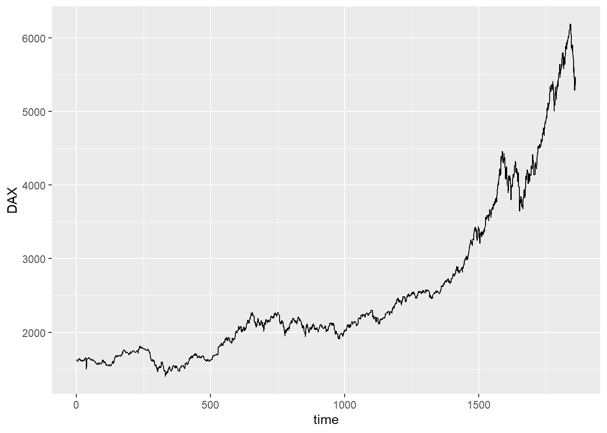
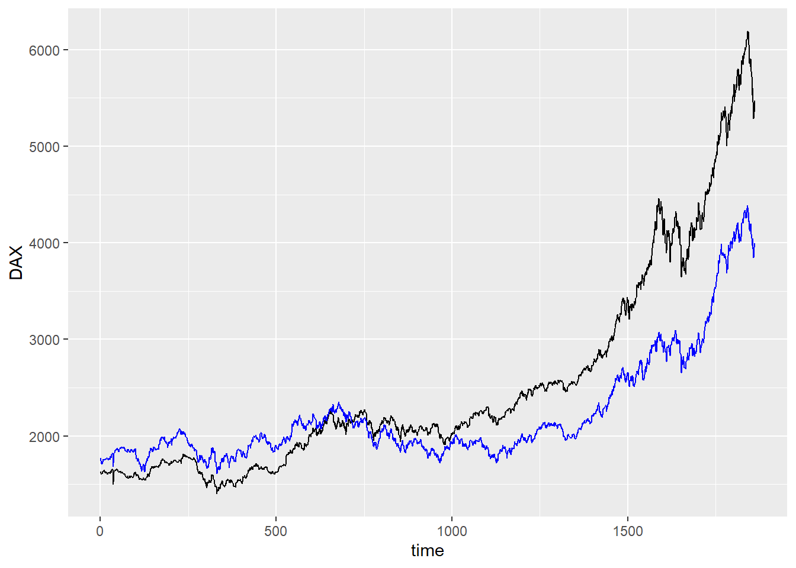
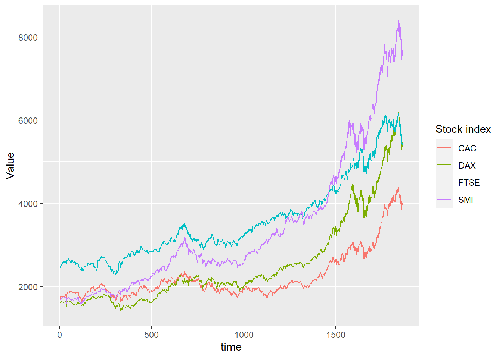
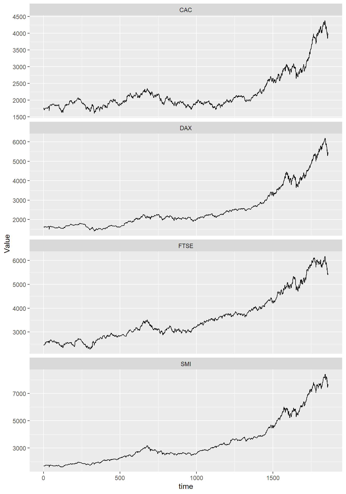

## Tidyr and ggplot2

::: {.cell}

```{.r .cell-code}
here::i_am("git-r-23.Rproj")
library(here)
library(ggplot2)
library(tidyr)
library(dplyr)
```
:::


### Multiple lines on a single graph - Wrong solution

::: {.cell}

```{.r .cell-code}
eustock <- as.data.frame(EuStockMarkets)
eustock <- eustock |> mutate(time=1:n())
```
:::

::: {.cell}

```{.r .cell-code}
ggplot(eustock, aes(x=time, y=DAX)) +
  geom_line()
```

::: {.cell-output-display}
{width=672}
:::
:::

How to plot 2 lines (with different values y) in the same graph ?

::: {.cell}

```{.r .cell-code}
ggplot(eustock, aes(x=time, y=DAX)) +
  geom_line() +
  geom_line(mapping = aes(y=CAC), color = "blue")
```

::: {.cell-output-display}
{width=672}
:::
:::

Problems in this representation:
- the y-axis name is wrong
- colors must be specified manually
- we miss a association between colors and names

We must reorganize the data set in a way that includes the mapping specifications. 

## Tidyr based solution

We must restructure the data set in a long format:

::: {.cell}

```{.r .cell-code}
long_eustock <- eustock |> pivot_longer(-time, names_to = "Stock index", values_to = "Value")
```
:::

pivot_longer = inverse of pivot_wider
At each time, the table links a variable 'value' associated with a name. The parameters names_to and values_to change the title of the columns. 


::: {.cell}

```{.r .cell-code}
ggplot(long_eustock, aes(x = time, y = Value, group = `Stock index`, color = `Stock index`)) +
  geom_line()
```

::: {.cell-output-display}
{width=672}
:::
:::

The grouping with "Stock index" allows to display the temporal evolution of the values of each stock group. 


::: {.cell}

```{.r .cell-code}
ggplot(long_eustock, aes(x = time, y = Value)) +
  geom_line() +
  facet_wrap(~`Stock index`, ncol = 1, scales = "free_y")
```

::: {.cell-output-display}
{width=672}
:::
:::

This representation is easier to read but doesn't allow to compare the evolution of each stock group. 

